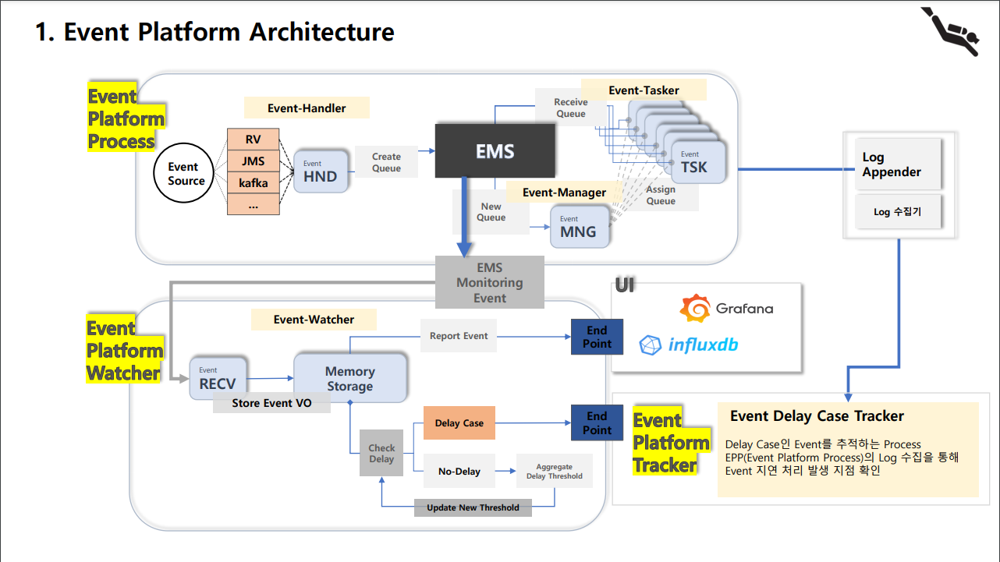
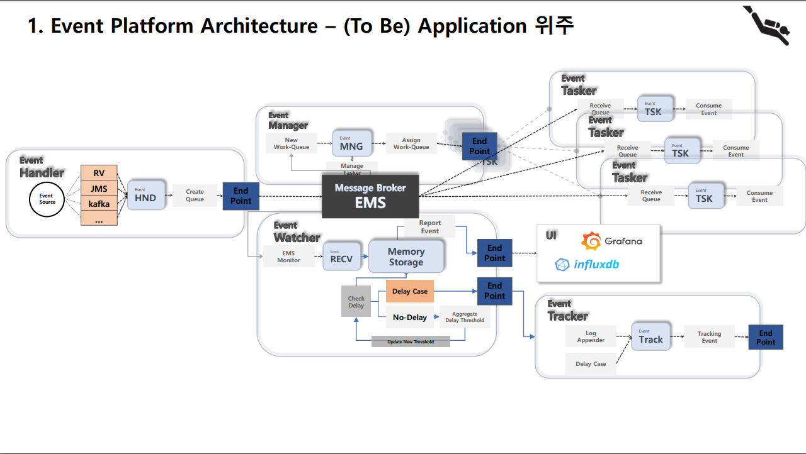

# EPP : EventPlatformProcess

## 0. Introduction
> EMS Message Broker를 이용하여 Event를 분산 처리 하는 <strong>Platform</string>으로 <strong>EP(Event Platform)</strong> 프로젝트의 하나로, Event 처리가 주 목적이다.  
>  : EEP is a Platform to handle event in Distributed System by using EMS Message Broker.
> - Event-Handler : 외부로의 Interface를 제공하여, EEP로 Event를 생성 할 수 있다.
> - Event-Manager : Event-Handler를 통해 생성된 Work-Queue를 감지해 Event-Tasker에게 Work-Queue를 분배해 Event를 처리하도록 한다.
> - Event-Tasker : Event-Manager를 통해 할당된 Work-Queue를 기준으로 Event를 처리한다.
> - Event-Simulator : 개발 상황과 기능 점검을 위해 Event-Handler 대신 생성된 Simulator로 EMS-Server로 Event를 생성한다.
>
>

## 1. Revision
>
> EP 전체 프로젝트의 진행을 Platform 단위보다 Application 단위로 진행할 계획이다.  
> Event-Handler, Event-Manager, Event-Tasker, Event-Watcher 등
> EP의 Application들은 EMS-Server로 느슨하게 결합되어 개발 되었기 때문에, 분리해서 개발 진행하는 것이 효율적이라 판단한다.
>
> ::: Application 단의로 분리 개발 장점.
>  1. 배포의 용이성
>  2. 관리의 용이성
>
> 

### 1-1. [AS-IS] Platform 위주의 Architecture

### 1-2. [TO-BE] Application 위주의 Architecture

> Application 위주로 프로젝트 구성.

